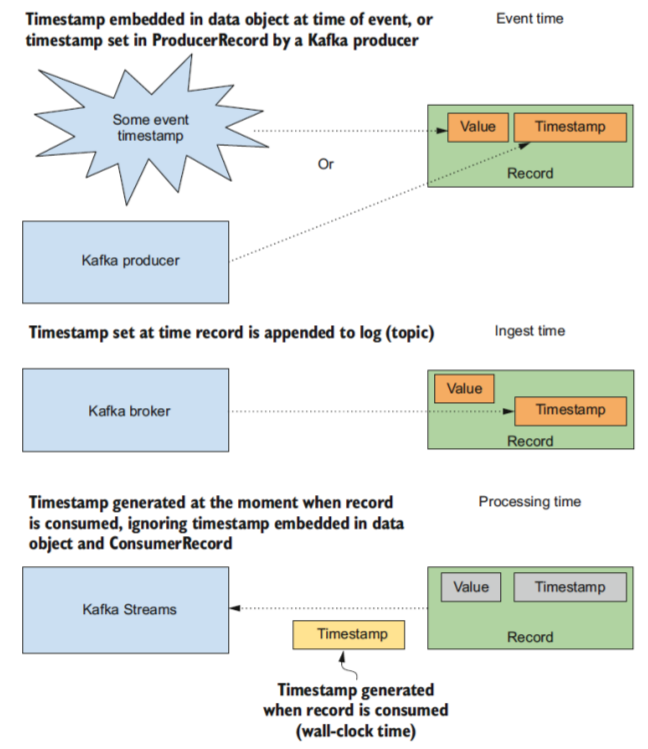

= DEVELOPING with KAFKA STREAMS
:toc:

link:http://kafka.apache.org/10/javadoc[Kafka 10 Javadocs]

== STREAMS DSL

== STREAMS & State

=== Ingredients of state in streams

State is nothing more than the ability to recall information you’ve seen before and connect it to current information. You can utilize state in different ways. 

* *accumulation of values*, provided by the Kafka Streams DSL.
* *Joining of streams* (closely related to the joins performed in database operations eg. such as joining records from the employee and department tables to generate a report on who staffs which departments
in a company.)
* What *state needs to look like* and what the requirements are for using state when we discuss *state stores* in Kafka Streams. 
* Importance of *timestamps* (ensuring you only work with events occurring within a given *time frame* or helping you work with data arriving out of order)

==== Stream Partitioning in Stream

* link:http://kafka.apache.org/10/javadoc/org/apache/kafka/streams/processor/StreamPartitioner.html[StreamPartitioner Javadoc]

* If events for single Customer ID are distributed amongst partitions (ie. no key associated) you will have an issue here (unless you’re using topics with only one partition). Because the key isn’t populated, round-robin assignment means the transactions for a given customer won’t land on the same partition.
* *Placing customer transactions with the same ID on the same partition is important*, because you need to look up records by ID in the state store. Otherwise, you’ll have customers with the same ID spread across different partitions, requiring you to look up the same customer in multiple state stores. _(This statement could be interpreted to mean that each partition has its own state store, but that’s not the case. Partitions are assigned to a *StreamTask* , and *each StreamTask has its own state store*.)_

===== StreamPartitioner

[source java]
----
org.apache.kafka.streams.processor.StreamPartitioner<K, V>

- Determine how records are distributed among the partitions in a Kafka topic. If not specified, the underlying producer's DefaultPartitioner will be used to determine the partition. 
- Kafka topics are divided into one or more partitions. Since each partition must fit on the servers that host it, so using multiple partitions allows the topic to scale beyond a size that will fit on a single machine. 
- Partitions also enable you to use multiple instances of your topology to process in parallel all of the records on the topology's source topics. 
- When a topology is instantiated, each of its sources are assigned a subset of that topic's partitions. That means that only those processors in that topology instance will consume the records from those partitions. 
- In many cases, Kafka Streams will automatically manage these instances, and adjust when new topology instances are added or removed. 
- Some topologies, though, need more control over which records appear in each partition. For example, some topologies that have stateful processors may want all records within a range of keys to always be 
 delivered to and handled by the same topology instance. An upstream topology producing records to that topic can use a custom stream partitioner to precisely and consistently determine to which partition each 
 record should be written. To do this, create a _StreamPartitioner_ implementation, and when you build your topology specify that  custom partitioner when adding a sink for that topic. 
- All StreamPartitioner implementations should be stateless and a pure function so they can be shared across topic and sink nodes.
See Also:
	TopologyBuilder.addSink(String, String, org.apache.kafka.common.serialization.Serializer, org.apache.kafka.common.serialization.Serializer, StreamPartitioner, String)
	TopologyBuilder.addSink(String, String, StreamPartitioner, String)

public class RewardsStreamPartitioner implements StreamPartitioner<String, Purchase> {

    @Override
    public Integer partition(String key, Purchase value, int numPartitions) {
        return value.getCustomerId().hashCode() % numPartitions;
    }
}
----

==== State stores in Kafka Streams

[source java]
----
String rewardsStateStoreName = "rewardsPointsStore";
KeyValueBytesStoreSupplier storeSupplier = Stores.inMemoryKeyValueStore(rewardsStateStoreName);
StoreBuilder<KeyValueStore<String, Integer>> storeBuilder = Stores.keyValueStoreBuilder(storeSupplier, Serdes.String(), Serdes.Integer());
builder.addStateStore(storeBuilder);
----

* _KeyValueBytesStoreSupplier_
* _Stores_
** _Stores.windowStoreBuilder(WindowBytesStoreSupplier, Serde<K>, Serde<V>)_
** _Stores.inMemoryKeyValueStore_
** _Stores.persistentKeyValueStore_
** _Stores.lruMap_
** _Stores.persistentSessionStore_
* _StoreBuilder_
** _StoreBuilder.withCachingEnabled_ 	(Enable caching on the store.)
** _StoreBuilder.withLoggingEnabled_ 	Maintain a changelog for any changes made to the store.
** _StoreBuilder.withLoggingDisabled_	Disable the changelog for store built by this {@link StoreBuilder} whici will turn off fault-tolerance for your store. By default the changelog is enabled.
** _StoreBuilder.logConfig_		Returns a Map containing any log configs that will be used when creating the changelog for the {@link StateStore}.
** _StoreBuilder.loggingEnabled_	      Return {@code true} if the {@link StateStore} should have logging enabled
** _StoreBuilder.name_	                Return the name of this state store builder.
* _KeyValueBytesStoreSupplier_
** _RocksDbKeyValueBytesStoreSupplier_
* _KeyValueStore_
** _InMemoryKeyValueStore_

[source java]
----
Setting changelog properties
Map<String, String> changeLogConfigs = new HashMap<>();
changeLogConfigs.put("retention.ms","172800000" );
changeLogConfigs.put("retention.bytes", "10000000000");
// to use with a StoreBuilder
storeBuilder.withLoggingEnabled(changeLogConfigs);
// to use with Materialized
Materialized.as(Stores.inMemoryKeyValueStore("foo")
.withLoggingEnabled(changeLogConfigs));

Setting a cleanup policy
Map<String, String> changeLogConfigs = new HashMap<>();
changeLogConfigs.put("retention.ms","172800000" );
changeLogConfigs.put("retention.bytes", "10000000000");
changeLogConfigs.put("cleanup.policy", "compact,delete");
----

==== Joining Kafka streams
Book section 4.4

==== Timestamps in Kafka Streams

Timestamps play a role in key areas of Kafka Streams functionality:
* Joining streams
* Updating a changelog ( KTable API)
* Deciding when the Processor.punctuate method is triggered (Processor API)

In stream processing, you can group timestamps into 3 categories:

1. *Event time:* A timestamp set when the event occurred, usually embedded in the object used to represent the event..
2. *Ingestion time:*  A timestamp set when the data first enters the data processing pipeline. You can consider the timestamp set by the Kafka broker (assuming a configuration setting of LogAppendTime ) to be ingestion time.
3. *Processing time:* A timestamp set when the data or event record first starts to flow through a processing pipeline.p

 

* *_TimestampExtractor_*
** _TransactionTimestampExtractor_ (custom implementation)
** *Note:* Default configuration setting is *_CreateTime_* for the timestamp, bear in mind that if you were to use *_LogAppendTime_* , this would return the timestamp value for when the Kafka broker appended the record to the log

[source, java]
----
public class TransactionTimestampExtractor implements TimestampExtractor {

    @Override
    public long extract(ConsumerRecord<Object, Object> record, long previousTimestamp) {
        Purchase purchasePurchaseTransaction = (Purchase) record.value();
        return purchasePurchaseTransaction.getPurchaseDate().getTime();
    }
}
----

* *_ExtractRecordMetadataTimestamp_* a list of classes that extend the ExtractRecordMetadataTimestamp class:
** *_FailOnInvalidTimestamp_*			—Throws an exception in the case of an invalid timestamp. 
** *_LogAndSkipOnInvalidTimestamp_* 		—Returns the invalid timestamp and logs a warning message that the record will be discarded due to the invalid timestamp.
** *_UsePreviousTimeOnInvalidTimestamp_*	 —In the case of an invalid timestamp, the last valid extracted timestamp is returned.
* *_WallclockTimestampExtractor_* provides process-time semantics and doesn’t extract any timestamps. Instead, it returns the time in milliseconds by calling the System.currentTimeMillis() method.

===== Specifying a TimestampExtractor
* *Option 1* - The first option is to set a global timestamp extractor, specified in the properties when setting up your Kafka Streams application. If no property is set, the default setting is *_FailOnInvalidTimestamp.class_* . For example, the following code would configure the TransactionTimestampExtractor via properties when setting up the application:

[source,java]
----
props.put(StreamsConfig.DEFAULT_TIMESTAMP_EXTRACTOR_CLASS_CONFIG,TransactionTimestampExtractor.class);
----
* *Option 2* - The second option is to provide a *_TimestampExtractor_* instance via a Consumed object with the advantage of doing this is that you have one TimestampExtractor per input source,
whereas the other option requires you to handle records from different topics in one TimestampExtractor instance.

[source,java]
----
Consumed.with(Serdes.String(), purchaseSerde).withTimestampExtractor(new TransactionTimestampExtractor()))
----

==== KAFKA Streams - Aggregations and windowing operations

* link:http://kafka.apache.org/10/javadoc/org/apache/kafka/streams/kstream/KGroupedStream.html[KGroupedStream]
When you use *_KStream.groupBy_* or *_KStream.groupByKey_* , the returned instance is a *_KGroupedStream_* . The *_KGroupedStream_* is an intermediate representation of the event stream after grouping by keys and is never meant for you to work with directly. 
** The *_KGroupedStream_* is required to perform aggregation operations, *which always result in a KTable* . Because the aggregate operations produce a *KTable* and use a state store, not all updates may end up being forwarded downstream.
* There’s an analogous *_KGroupedTable_* resulting from the *_KTable.groupBy_* method, which is the intermediate representation of the update stream regrouped by key.

[source, java]
----
package org.apache.kafka.streams.kstream;

import org.apache.kafka.common.annotation.InterfaceStability;
import org.apache.kafka.common.utils.Bytes;
import org.apache.kafka.streams.KafkaStreams;
import org.apache.kafka.streams.KeyValue;
import org.apache.kafka.streams.StreamsConfig;
import org.apache.kafka.streams.Topology;
import org.apache.kafka.streams.state.KeyValueStore;
import org.apache.kafka.streams.state.QueryableStoreType;

/**
 * {@code KGroupedStream} is an abstraction of a <i>grouped</i> record stream of {@link KeyValue} pairs.
 * It is an intermediate representation of a {@link KStream} in order to apply an aggregation operation on the original
 * {@link KStream} records.
 * 

 * It is an intermediate representation after a grouping of a {@link KStream} before an aggregation is applied to the
 * new partitions resulting in a {@link KTable}.
 * 

 * A {@code KGroupedStream} must be obtained from a {@link KStream} via {@link KStream#groupByKey() groupByKey()} or
 * {@link KStream#groupBy(KeyValueMapper) groupBy(...)}.
 *
 * @param <K> Type of keys
 * @param <V> Type of values
 * @see KStream
 */
@InterfaceStability.Evolving
public interface KGroupedStream<K, V> {

    /**
     * Count the number of records in this stream by the grouped key.
     * Records with {@code null} key or value are ignored.
     * The result is written into a local {@link KeyValueStore} (which is basically an ever-updating materialized view).
     * Furthermore, updates to the store are sent downstream into a {@link KTable} changelog stream.
     * 

     * Not all updates might get sent downstream, as an internal cache is used to deduplicate consecutive updates to
     * the same key.
     * The rate of propagated updates depends on your input data rate, the number of distinct keys, the number of
     * parallel running Kafka Streams instances, and the {@link StreamsConfig configuration} parameters for
     * {@link StreamsConfig#CACHE_MAX_BYTES_BUFFERING_CONFIG cache size}, and
     * {@link StreamsConfig#COMMIT_INTERVAL_MS_CONFIG commit intervall}.
     * 

     * For failure and recovery the store will be backed by an internal changelog topic that will be created in Kafka.
     * The changelog topic will be named "${applicationId}-${internalStoreName}-changelog", where "applicationId" is
     * user-specified in {@link StreamsConfig} via parameter
     * {@link StreamsConfig#APPLICATION_ID_CONFIG APPLICATION_ID_CONFIG}, "internalStoreName" is an internal name
     * and "-changelog" is a fixed suffix.
     * Note that the internal store name may not be queriable through Interactive Queries.
     *
     * You can retrieve all generated internal topic names via {@link Topology#describe()}.
     *
     * @return a {@link KTable} that contains "update" records with unmodified keys and {@link Long} values that
     * represent the latest (rolling) count (i.e., number of records) for each key
     */
    KTable<K, Long> count();

    /**
     * Count the number of records in this stream by the grouped key.
     * Records with {@code null} key or value are ignored.
     * The result is written into a local {@link KeyValueStore} (which is basically an ever-updating materialized view)
     * provided by the given store name in {@code materialized}.
     * Furthermore, updates to the store are sent downstream into a {@link KTable} changelog stream.
     * 

     * Not all updates might get sent downstream, as an internal cache is used to deduplicate consecutive updates to
     * the same key.
     * The rate of propagated updates depends on your input data rate, the number of distinct keys, the number of
     * parallel running Kafka Streams instances, and the {@link StreamsConfig configuration} parameters for
     * {@link StreamsConfig#CACHE_MAX_BYTES_BUFFERING_CONFIG cache size}, and
     * {@link StreamsConfig#COMMIT_INTERVAL_MS_CONFIG commit intervall}.
     * 

     * To query the local {@link KeyValueStore} it must be obtained via
     * {@link KafkaStreams#store(String, QueryableStoreType) KafkaStreams#store(...)}.
     * <pre>{@code
     * KafkaStreams streams = ... // counting words
     * String queryableStoreName = "storeName"; // the store name should be the name of the store as defined by the Materialized instance
     * ReadOnlyKeyValueStore<String,Long> localStore = streams.store(queryableStoreName, QueryableStoreTypes.<String, Long>keyValueStore());
     * String key = "some-word";
     * Long countForWord = localStore.get(key); // key must be local (application state is shared over all running Kafka Streams instances)
     * }</pre>
     * For non-local keys, a custom RPC mechanism must be implemented using {@link KafkaStreams#allMetadata()} to
     * query the value of the key on a parallel running instance of your Kafka Streams application.
     *
     * 

     * For failure and recovery the store will be backed by an internal changelog topic that will be created in Kafka.
     * Therefore, the store name defined by the Materialized instance must be a valid Kafka topic name and cannot contain characters other than ASCII
     * alphanumerics, '.', '_' and '-'.
     * The changelog topic will be named "${applicationId}-${storeName}-changelog", where "applicationId" is
     * user-specified in {@link StreamsConfig} via parameter
     * {@link StreamsConfig#APPLICATION_ID_CONFIG APPLICATION_ID_CONFIG}, "storeName" is the
     * provide store name defined in {@code Materialized}, and "-changelog" is a fixed suffix.
     *
     * You can retrieve all generated internal topic names via {@link Topology#describe()}.
     *
     * @param materialized  an instance of {@link Materialized} used to materialize a state store. Cannot be {@code null}.
     *                      Note: the valueSerde will be automatically set to {@link org.apache.kafka.common.serialization.Serdes#Long() Serdes#Long()}
     *                      if there is no valueSerde provided
     * @return a {@link KTable} that contains "update" records with unmodified keys and {@link Long} values that
     * represent the latest (rolling) count (i.e., number of records) for each key
     */
    KTable<K, Long> count(final Materialized<K, Long, KeyValueStore<Bytes, byte[]>> materialized);

    /**
     * Combine the values of records in this stream by the grouped key.
     * Records with {@code null} key or value are ignored.
     * Combining implies that the type of the aggregate result is the same as the type of the input value
     * (c.f. {@link #aggregate(Initializer, Aggregator)}).
     * 

     * The specified {@link Reducer} is applied for each input record and computes a new aggregate using the current
     * aggregate and the record's value.
     * If there is no current aggregate the {@link Reducer} is not applied and the new aggregate will be the record's
     * value as-is.
     * Thus, {@code reduce(Reducer, String)} can be used to compute aggregate functions like sum, min, or max.
     * 

     * Not all updates might get sent downstream, as an internal cache is used to deduplicate consecutive updates to
     * the same key.
     * The rate of propagated updates depends on your input data rate, the number of distinct keys, the number of
     * parallel running Kafka Streams instances, and the {@link StreamsConfig configuration} parameters for
     * {@link StreamsConfig#CACHE_MAX_BYTES_BUFFERING_CONFIG cache size}, and
     * {@link StreamsConfig#COMMIT_INTERVAL_MS_CONFIG commit intervall}.
     *
     * 

     * For failure and recovery the store will be backed by an internal changelog topic that will be created in Kafka.
     * The changelog topic will be named "${applicationId}-${internalStoreName}-changelog", where "applicationId" is
     * user-specified in {@link StreamsConfig} via parameter
     * {@link StreamsConfig#APPLICATION_ID_CONFIG APPLICATION_ID_CONFIG}, "internalStoreName" is an internal name
     * and "-changelog" is a fixed suffix.
     * Note that the internal store name may not be queriable through Interactive Queries.
     *
     * You can retrieve all generated internal topic names via {@link Topology#describe()}.
     *
     * @param reducer   a {@link Reducer} that computes a new aggregate result. Cannot be {@code null}.
     * @return a {@link KTable} that contains "update" records with unmodified keys, and values that represent the
     * latest (rolling) aggregate for each key
     */
    KTable<K, V> reduce(final Reducer<V> reducer);

    /**
     * Combine the value of records in this stream by the grouped key.
     * Records with {@code null} key or value are ignored.
     * Combining implies that the type of the aggregate result is the same as the type of the input value
     * (c.f. {@link #aggregate(Initializer, Aggregator, Materialized)}).
     * The result is written into a local {@link KeyValueStore} (which is basically an ever-updating materialized view)
     * provided by the given store name in {@code materialized}.
     * Furthermore, updates to the store are sent downstream into a {@link KTable} changelog stream.
     * 

     * The specified {@link Reducer} is applied for each input record and computes a new aggregate using the current
     * aggregate (first argument) and the record's value (second argument):
     * <pre>{@code
     * // At the example of a Reducer<Long>
     * new Reducer<Long>() {
     *   public Long apply(Long aggValue, Long currValue) {
     *     return aggValue + currValue;
     *   }
     * }
     * }</pre>
     * 

     * If there is no current aggregate the {@link Reducer} is not applied and the new aggregate will be the record's
     * value as-is.
     * Thus, {@code reduce(Reducer, Materialized)} can be used to compute aggregate functions like sum, min, or
     * max.
     * 

     * Not all updates might get sent downstream, as an internal cache is used to deduplicate consecutive updates to
     * the same key.
     * The rate of propagated updates depends on your input data rate, the number of distinct keys, the number of
     * parallel running Kafka Streams instances, and the {@link StreamsConfig configuration} parameters for
     * {@link StreamsConfig#CACHE_MAX_BYTES_BUFFERING_CONFIG cache size}, and
     * {@link StreamsConfig#COMMIT_INTERVAL_MS_CONFIG commit intervall}.
     * 

     * To query the local {@link KeyValueStore} it must be obtained via
     * {@link KafkaStreams#store(String, QueryableStoreType) KafkaStreams#store(...)}.
     * <pre>{@code
     * KafkaStreams streams = ... // compute sum
     * String queryableStoreName = "storeName" // the store name should be the name of the store as defined by the Materialized instance
     * ReadOnlyKeyValueStore<String,Long> localStore = streams.store(queryableStoreName, QueryableStoreTypes.<String, Long>keyValueStore());
     * String key = "some-key";
     * Long sumForKey = localStore.get(key); // key must be local (application state is shared over all running Kafka Streams instances)
     * }</pre>
     * For non-local keys, a custom RPC mechanism must be implemented using {@link KafkaStreams#allMetadata()} to
     * query the value of the key on a parallel running instance of your Kafka Streams application.
     *
     * 

     * For failure and recovery the store will be backed by an internal changelog topic that will be created in Kafka.
     * The changelog topic will be named "${applicationId}-${internalStoreName}-changelog", where "applicationId" is
     * user-specified in {@link StreamsConfig} via parameter
     * {@link StreamsConfig#APPLICATION_ID_CONFIG APPLICATION_ID_CONFIG}, "internalStoreName" is an internal name
     * and "-changelog" is a fixed suffix.
     * Note that the internal store name may not be queriable through Interactive Queries.
     *
     * You can retrieve all generated internal topic names via {@link Topology#describe()}.
     *
     * @param reducer       a {@link Reducer} that computes a new aggregate result. Cannot be {@code null}.
     * @param materialized  an instance of {@link Materialized} used to materialize a state store. Cannot be {@code null}.
     * @return a {@link KTable} that contains "update" records with unmodified keys, and values that represent the
     * latest (rolling) aggregate for each key
     */
    KTable<K, V> reduce(final Reducer<V> reducer,
                        final Materialized<K, V, KeyValueStore<Bytes, byte[]>> materialized);

    /**
     * Aggregate the values of records in this stream by the grouped key.
     * Records with {@code null} key or value are ignored.
     * Aggregating is a generalization of {@link #reduce(Reducer) combining via reduce(...)} as it, for example,
     * allows the result to have a different type than the input values.
     * 

     * The specified {@link Initializer} is applied once directly before the first input record is processed to
     * provide an initial intermediate aggregation result that is used to process the first record.
     * The specified {@link Aggregator} is applied for each input record and computes a new aggregate using the current
     * aggregate (or for the very first record using the intermediate aggregation result provided via the
     * {@link Initializer}) and the record's value.
     * Thus, {@code aggregate(Initializer, Aggregator)} can be used to compute aggregate functions like
     * count (c.f. {@link #count()}).
     * 

     * The default value serde from config will be used for serializing the result.
     * If a different serde is required then you should use {@link #aggregate(Initializer, Aggregator, Materialized)}.
     * 

     * Not all updates might get sent downstream, as an internal cache is used to deduplicate consecutive updates to
     * the same key.
     * The rate of propagated updates depends on your input data rate, the number of distinct keys, the number of
     * parallel running Kafka Streams instances, and the {@link StreamsConfig configuration} parameters for
     * {@link StreamsConfig#CACHE_MAX_BYTES_BUFFERING_CONFIG cache size}, and
     * {@link StreamsConfig#COMMIT_INTERVAL_MS_CONFIG commit intervall}.
     *
     * 

     * For failure and recovery the store will be backed by an internal changelog topic that will be created in Kafka.
     * The changelog topic will be named "${applicationId}-${internalStoreName}-changelog", where "applicationId" is
     * user-specified in {@link StreamsConfig} via parameter
     * {@link StreamsConfig#APPLICATION_ID_CONFIG APPLICATION_ID_CONFIG}, "internalStoreName" is an internal name
     * and "-changelog" is a fixed suffix.
     * Note that the internal store name may not be queriable through Interactive Queries.
     *
     * You can retrieve all generated internal topic names via {@link Topology#describe()}.
     *
     * @param initializer   an {@link Initializer} that computes an initial intermediate aggregation result
     * @param aggregator    an {@link Aggregator} that computes a new aggregate result
     * @param <VR>          the value type of the resulting {@link KTable}
     * @return a {@link KTable} that contains "update" records with unmodified keys, and values that represent the
     * latest (rolling) aggregate for each key
     */
    <VR> KTable<K, VR> aggregate(final Initializer<VR> initializer,
                                 final Aggregator<? super K, ? super V, VR> aggregator);

    /**
     * Aggregate the values of records in this stream by the grouped key.
     * Records with {@code null} key or value are ignored.
     * Aggregating is a generalization of {@link #reduce(Reducer) combining via reduce(...)} as it, for example,
     * allows the result to have a different type than the input values.
     * The result is written into a local {@link KeyValueStore} (which is basically an ever-updating materialized view)
     * that can be queried by the given store name in {@code materialized}.
     * Furthermore, updates to the store are sent downstream into a {@link KTable} changelog stream.
     * 

     * The specified {@link Initializer} is applied once directly before the first input record is processed to
     * provide an initial intermediate aggregation result that is used to process the first record.
     * The specified {@link Aggregator} is applied for each input record and computes a new aggregate using the current
     * aggregate (or for the very first record using the intermediate aggregation result provided via the
     * {@link Initializer}) and the record's value.
     * Thus, {@code aggregate(Initializer, Aggregator, Serde, String)} can be used to compute aggregate functions like
     * count (c.f. {@link #count()}).
     * 

     * Not all updates might get sent downstream, as an internal cache is used to deduplicate consecutive updates to
     * the same key.
     * The rate of propagated updates depends on your input data rate, the number of distinct keys, the number of
     * parallel running Kafka Streams instances, and the {@link StreamsConfig configuration} parameters for
     * {@link StreamsConfig#CACHE_MAX_BYTES_BUFFERING_CONFIG cache size}, and
     * {@link StreamsConfig#COMMIT_INTERVAL_MS_CONFIG commit intervall}.
     * 

     * To query the local {@link KeyValueStore} it must be obtained via
     * {@link KafkaStreams#store(String, QueryableStoreType) KafkaStreams#store(...)}:
     * <pre>{@code
     * KafkaStreams streams = ... // some aggregation on value type double
     * String queryableStoreName = "storeName" // the store name should be the name of the store as defined by the Materialized instance
     * ReadOnlyKeyValueStore<String,Long> localStore = streams.store(queryableStoreName, QueryableStoreTypes.<String, Long>keyValueStore());
     * String key = "some-key";
     * Long aggForKey = localStore.get(key); // key must be local (application state is shared over all running Kafka Streams instances)
     * }</pre>
     * For non-local keys, a custom RPC mechanism must be implemented using {@link KafkaStreams#allMetadata()} to
     * query the value of the key on a parallel running instance of your Kafka Streams application.
     *
     * 

     * For failure and recovery the store will be backed by an internal changelog topic that will be created in Kafka.
     * Therefore, the store name defined by the Materialized instance must be a valid Kafka topic name and cannot contain characters other than ASCII
     * alphanumerics, '.', '_' and '-'.
     * The changelog topic will be named "${applicationId}-${storeName}-changelog", where "applicationId" is
     * user-specified in {@link StreamsConfig} via parameter
     * {@link StreamsConfig#APPLICATION_ID_CONFIG APPLICATION_ID_CONFIG}, "storeName" is the
     * provide store name defined in {@code Materialized}, and "-changelog" is a fixed suffix.
     *
     * You can retrieve all generated internal topic names via {@link Topology#describe()}.
     *
     * @param initializer   an {@link Initializer} that computes an initial intermediate aggregation result
     * @param aggregator    an {@link Aggregator} that computes a new aggregate result
     * @param materialized  an instance of {@link Materialized} used to materialize a state store. Cannot be {@code null}.
     * @param <VR>          the value type of the resulting {@link KTable}
     * @return a {@link KTable} that contains "update" records with unmodified keys, and values that represent the
     * latest (rolling) aggregate for each key
     */
    <VR> KTable<K, VR> aggregate(final Initializer<VR> initializer,
                                 final Aggregator<? super K, ? super V, VR> aggregator,
                                 final Materialized<K, VR, KeyValueStore<Bytes, byte[]>> materialized);

    /**
     * Create a new {@link TimeWindowedKStream} instance that can be used to perform windowed aggregations.
     * @param windows the specification of the aggregation {@link Windows}
     * @param <W>     the window type
     * @return an instance of {@link TimeWindowedKStream}
     */
    <W extends Window> TimeWindowedKStream<K, V> windowedBy(final Windows<W> windows);

    /**
     * Create a new {@link SessionWindowedKStream} instance that can be used to perform session windowed aggregations.
     * @param windows the specification of the aggregation {@link SessionWindows}
     * @return an instance of {@link TimeWindowedKStream}
     */
    SessionWindowedKStream<K, V> windowedBy(final SessionWindows windows);

}
----

===== GroupByKey vs. GroupBy

* *_KStream_* has 2 methods for grouping records: *_GroupByKey_* and *_GroupB_*y and both return a *_KGroupedTable_*
* *_GroupByKey_* method is for when your *_KStream_* already has non-null keys and more importantly, the *“needs repartitioning”* flag is never set.
* *_GroupBy_* method assumes you’ve modified the key for the grouping, so the *repartition flag is set to true*. 
** After calling *_GroupBy_* , joins, aggregations, and the like will result in automatic repartitioning. The bottom line is that you should prefer GroupByKey over GroupBy whenever possible.

