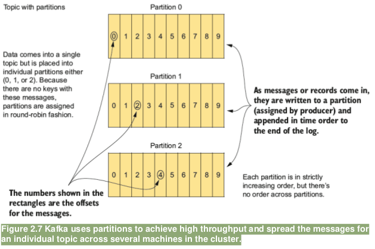
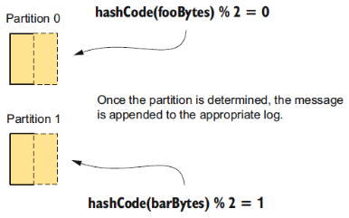

= KAFKA

This are the fundamentals to be aware about KAFKA that may affect scenario building

== KAFKA Logs

=== How logs work in Kafka

* When you install Kafka, one of the configuration settings is *log.dir* , which specifies where Kafka stores log data. 
* Each topic maps to a subdirectory under the specified log directory. There will be as many subdirectories as there are topic partitions, with a format of *_partition-name_partition-number_*
* Inside each directory is the log file where incoming messages are appended. 
* The logs directory is the base storage for messages. 
* Each directory under */logs* represents a topic partition. *Filenames within the directory start with the name of the topic, followed by an underscore, which is followed by a partition number*.
* The topic name gives you a good handle on which log the messages sent to Kafka via producers will be stored in. 

* Log Directory Parameter
** *KAFKA*   :  *_log.dir_*
** *STRIMZI* :  ??

Once the log files reach a certain size (either a number of records or size on disk), or when a configured time difference between message timestamps is reached, the log file is “rolled,” and Kafka appends incoming messages to a new log (see figure 2.6).

* Log Rollover Time Based Parameter
** *KAFKA*   :  
*** *_log.roll.ms_* 	This is the primary configuration, but there’s no default value.
*** *_log.roll.hours_* 	This is the secondary configuration, which is only used if *_log.role.ms_* isn’t set. It defaults to 168 hours.
** *STRIMZI* :  ??

Log Rollover Size Based Parameter
** *KAFKA*   :  ??
** *STRIMZI* :  ??

* Log Rollover No. Of Recs Based Parameter
** *KAFKA*   :  ??
** *STRIMZI* :  ??

* Log Rention/Deletion Time Based Parameter
** *KAFKA*   :  ??
*** *_log.retention.ms_* 	How long to keep a log file in milliseconds
*** *_log.retention.minutes_* 	How long to keep a log file in minutes
*** *_log.retention.hours_* 	Log file retention in hours
** *STRIMZI* :  ??

* Log Rention/Deletion Size Based Parameter
** *KAFKA*   :  ??
*** *_log.retention.bytes_* 	specified with a longer rolling-time threshold to keep down I/O operations
*** *_log.segment.bytess_* 	To guard against the case of a significant spike in volume when there are relatively large roll settings governs how large an individual log segment can be.
*** *_log.retention.hours_* 	Log file retention in hours
** *STRIMZI* :  ??

== Kafka and partitions

Partitions are a critical part of Kafka’s design. They’re essential for performance, and *they guarantee that data with the same keys will be sent to the same consumer* and in order. 

 

* Partitioning a topic splits the data forwarded to a topic across parallel streams, and it’s key to how Kafka achieves its tremendous throughput. 
* A topic is a distributed log; each partition is similarly a log unto itself and follows the same rules.
* Kafka appends each incoming message to the end of the log, and all messages are strictly time-ordered. 
* Each message has an offset number assigned to it. 
* The order of messages across partitions isn’t guaranteed, but the order of messages within each partition is guaranteed.
* Partitioning serves another purpose, aside from increasing throughput. It allows topic messages to be spread across several machines so that the capacity of a given topic isn’t limited to the available disk space on one server.
* Now let’s look at another critical role partitions play: ensuring messages with the same keys end up together

=== Partitions group data by key
* Kafka works with data in key/value pairs. 
** If the keys are null, the Kafka producer will write records to partitions chosen in a round-robin fashion. 

 
foo” is sent to partition 0, and “bar” is sent to partition 1. You obtain the partition by hashing the bytes of the key, modulus the number of partitions.

** If the keys aren’t null, Kafka uses the following formula (shown in pseudocode) to determine which partition to send the key/value pair to:

[source, java]
----
HashCode.(key) % number of partitions
----

* By using a deterministic approach to select a partition, records with the same key will always be sent to the same partition and in order. 
* The *default partitioner uses this approach*; if you need a different strategy for selecting partitions, you can provide a custom partitioner.
* Specifying a *custom partitioner* Parameter (specify a different partitioner when configuring the Kafka producer)
** *KAFKA*   :  *partitioner.class=*com.custom.partitioner.PurchaseKeyPartitioner
** *STRIMZI* :  ??

=== Choosing Right No. Of Partitions

link:https://www.confluent.io/blog/how-to-choose-the-number-of-topicspartitions-in-a-kafka-cluster/[How to choose the number of topics/partitions in a Kafka cluster?]

* On *both the producer and the broker side*, writes to different partitions can be done fully in parallel. 
* On the *consumer side*, Kafka always gives a single partition’s data to one consumer thread. Thus, the degree of parallelism in the consumer (within a consumer group) is bounded by the number of partitions being consumed. Therefore, in general, the more partitions there are in a Kafka cluster, the higher the throughput one can achieve.

* A *rough formula* for picking the number of partitions is based on *throughput*. 
** Measure the throughout that you can achieve on a single partition for 
*** *production* (call it *p*) and 
*** *consumption* (call it *c*). 
*** and lets say your *target throughput* is *t*. 
Then you need to have at least 
[source, bash]
----
max(t/p, t/c) partitions
----

* per-partition throughput that one can achieve on the producer depends on configurations such as 
** the batching size, 
** compression codec, 
** type of acknowledgement, 
** replication factor, etc. , 

* producer batching size Parameter
** *KAFKA*   :  ??
** *STRIMZI* :  ??
* compression codec Parameter
** *KAFKA*   :  ??
** *STRIMZI* :  ??
* type of acknowledgement Parameter
** *KAFKA*   :  ??
** *STRIMZI* :  ??
* replication factor Parameter
** *KAFKA*   :  ??
** *STRIMZI* :  ??

* The *consumer throughput* is often application dependent since it corresponds to how fast the consumer logic can process each message. So, you really need to measure it.
* *Warning:* Although it’s possible to increase the number of partitions over time, one has to be careful if messages are produced with keys. When publishing a keyed message, Kafka deterministically maps the message to a partition based on the hash of the key. This provides a guarantee that messages with the same key are always routed to the same partition. This guarantee can be important for certain applications since messages within a partition are always delivered in order to the consumer. *If the number of partitions changes,* such a guarantee may no longer hold. To avoid this situation, a common practice is to over-partition a bit. Basically, you determine the number of partitions based on a future target throughput, say for one or two years later. Initially, you can just have a small Kafka cluster based on your current throughput. Over time, you can add more brokers to the cluster and proportionally move a subset of the existing partitions to the new brokers (which can be done online). This way, you can keep up with the throughput growth without breaking the semantics in the application when keys are used.

In addition to *throughput*, there are a few other factors that are worth considering when choosing the number of partitions. As you will see, in some cases, having too many partitions may also have negative impact.
1. More Partitions Requires More Open File Handles
2. More Partitions May Increase Unavailability
3. More Partitions May Increase End-to-end Latency
4. More Partitions May Require More Memory In the Client

== KAFKA Producer

SimpleProducer example
[source, java]
----
Properties properties = new Properties();
properties.put("bootstrap.servers", "localhost:9092");
properties.put("key.serializer", "org.apache.kafka.common.serialization.StringSerializer");
properties.put("value.serializer","org.apache.kafka.common.serialization.StringSerializer");
properties.put("acks", "1");
properties.put("retries", "3");
properties.put("compression.type", "snappy");
properties.put("partitioner.class",

PurchaseKeyPartitioner.class.getName());
PurchaseKey key = new PurchaseKey("12334568", new Date());
try(Producer<PurchaseKey, String> producer = new KafkaProducer<> (properties)) {
  ProducerRecord<PurchaseKey, String>
  record = new ProducerRecord<>("transactions", key, "{\"item\":\"book\",\"price\":10.99}");
  Callback callback = (metadata, exception) -> {
    if (exception != null) {
      System.out.println("Encountered exception "+ exception);
    } 
  };
  Future<RecordMetadata> sendFuture = producer.send(record, callback);
}
----

=== Producer properties
* *Bootstrap servers:* bootstrap.servers is a comma-separated list of host:port values. Eventually the producer will use all the brokers in the cluster; this list is used for initially connecting to the cluster.
* *Serialization:* *_key.serializer_* and *_value.serializer_* instruct Kafka how to convert the keys and values into byte arrays. Internally, Kafka uses byte arrays for keys and values, so you need to provide Kafka with the correct serializers to convert objects to byte arrays before them sending across the wire.
* *acks:*  acks specifies the minimum number of acknowledgments from a broker that the producer will wait for before considering a record send completed. Valid values for acks are all , 0 , and 1 . With a value of all , the producer will wait for a broker to receive confirmation that all followers have committed the record. When set to 1 , the broker writes the record to its log but doesn’t wait for any followers to acknowledge committing the record. A value of 0 means the producer won’t wait for any acknowledgments—this is mostly fire-and-forget.
* *Retries:* If sending a batch results in a failure, retries specifies the number of times to attempt to resend. If record order is important, you should consider setting *_max.in.flight.requests.per.connection_* to 1 to prevent the scenario of a second batch being sent successfully before a failed record being sent as the result a retry.
* *Compression type:* *_compression.type_* specifies what compression algorithm to apply, if any. If set, *_compression.type_* instructs the producer to compress a batch before sending. Note that it’s the entire batch that’s compressed, not individual records.
* *Partitioner class:* *_partitioner.class*_ specifies the name of the class implementing the Partitioner interface. The *_partitioner.class*_ is related to our earlier discussion of custom partitioners discussion in section 2.3.72.11.
For more information about producer configuration, see the Kafka documentation: http://kafka.apache.org/documentation/#producerconfigs .

== KAFKA Consumers

=== Managing Consumer Offsets
*_KafkaConsumer_* manages some state by periodically committing the offsets of messages consumed from Kafka. Offsets uniquely identify messages and represent the starting positions of messages in the log. 
* Consumers periodically need to commit the offsets of messages they have received. Committing an offset has two implications for a consumer: 
** Committing implies the consumer has fully processed the message.
** Committing also represents the starting point for that consumer in the case of failure or a restart.

If you have a new consumer instance or some failure has occurred, and the last committed offset isn’t available, where the consumer starts from will depend on your configuration:
* *_auto.offset.reset="earliest"_*	Messages will be retrieved starting at the earliest available offset. Any messages that haven’t yet been removed by the log-management process will be retrieved.
* *_auto.offset.reset="latest"_*	Messages will be retrieved from the latest offset, essentially only consuming messages from the point of joining the cluster.
* *_auto.offset.reset="none"_*		No reset strategy is specified. The broker throws an exception to the consumer

* Consumer Automatic offset commits
** *KAFKA*   :  
*** *_ enable.auto.commit_*	Automatic offset commits are enabled by default
*** *_auto.commit.interval.ms_*	This is a companion configuration option, which specifies how often the consumer will commit offsets (the default value is 5 seconds). If value it’s too small, it will increase network traffic; if it’s too large, it could result in the consumer receiving large amounts of repeated data in the event of a failure or restart.
** *STRIMZI* :  ??

=== Consumers and partitions

* You want multiple consumer instances *—one for each partition of a topic*.
* This consumer-per-partition pattern maximizes throughput, but *if you spread your consumers across multiple applications or machines, the total thread count across all instances shouldn’t exceed the total number of partitions in the topic*. 
* *Note:* A consumer can subscribe to an arbitrary number of topics.
* The leader broker assigns topic partitions to all available consumers with the same *_group.id_*. 
* The *_group.id_* is a configuration setting that identifies the consumer as belonging to a consumer group —that way, consumers don’t need to reside on the same machine. In fact, it’s probably preferable to have your consumers spread out across a few machines. That way, in the case of one machine failing, the leader broker can assign topic partitions to consumers on good machines.

ThreadedConsumerExample example
[source, java]
----
  public void startConsuming() {
    executorService = Executors.newFixedThreadPool(numberPartitions);
    Properties properties = getConsumerProps();
    for (int i = 0; i < numberPartitions; i++) {
      Runnable consumerThread = getConsumerThread(properties);
      executorService.submit(consumerThread);
    }
  }

  private Runnable getConsumerThread(Properties properties) {
    return () -> {
      Consumer<String, String> consumer = null;
      try {
        consumer = new KafkaConsumer<>(properties);
        consumer.subscribe(Collections.singletonList("test-topic"));
        while (!doneConsuming) {
          ConsumerRecords<String, String> records = consumer.poll(5000);
          for (ConsumerRecord<String, String> record : records) {
            String message = String.format("Consumed: key = %s value = %s with offset = %d partition = %d", record.key(), record.value(), record.offset(), record.partition());
            System.out.println(message);
          }
        }
      } catch (Exception e) {
          e.printStackTrace();
      } finally {
        if (consumer != null) {
          consumer.close();
        }
      }
    };
  }
----

