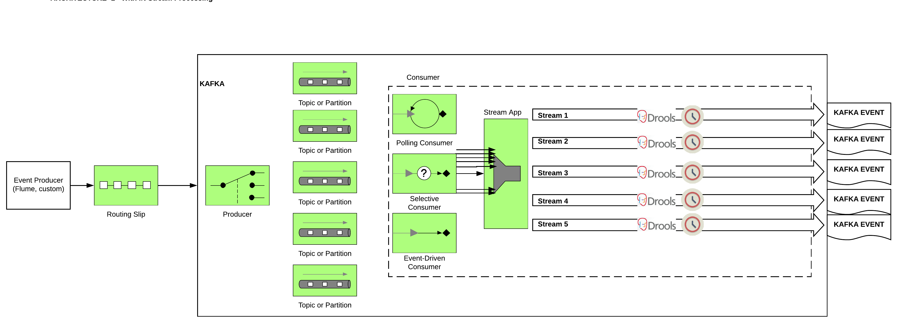
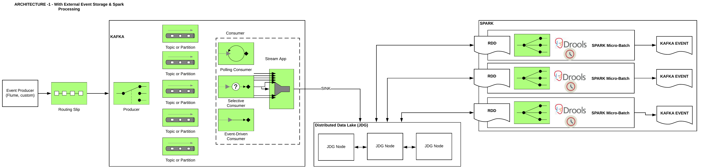

= Streaming CEP
:toc:

= SCENARIO (Design)

*TBD*

* *Topic 1:* Transaction
** -> GDPR (filter personal details)
**  -> Custom Partitioning with StreamPartitioner	http://kafka.apache.org/10/javadoc/org/apache/kafka/streams/processor/StreamPartitioner.html
     If you’ve modified or changed keys and you don’t need a custom partition strategy, you can rely on the DefaultPartitioner of the internal Kafka Streams KafkaProducer to handle the partitioning. But if you’d like to apply your own partitioning approach, you can use StreamPartitioner.

*** -> Rewards Poings --> period (size)
*** -> Fraud --> period (time)
*** -> Credit Scoring --> period (time & size)
**** -> Increase/Decrease/Adjust credit card limit

* *(maybe Topic 3?)*   --> Product Scoring --> combine streams (Fraud, Rewards, Credit Scoring) --> over a period --> 
** -> Open up new Offers
*** -> Revoke offers

* *Topic 2:* Products STATE
** -> ??

Additionally:

* Think Industry
* Think Channel (mobile, web, in-person)
 *Think Merchent

Consider Technical 
* Splitting Stream (Chapter 2 or 3)
* Aggregation & Windowing (Chapter 5)

== Goals

Our goals based on the use case and implemented code is to show

* How it is possible to do CEP on top of OCP
* How to size such an environment
* What was the architecture (learnings good/bad)
* What was failover/scalability of the environment app (learnings good/bad)
* What was the performance (report on constraints)

*How/What To BenchMark* link:https://engineering.linkedin.com/kafka/benchmarking-apache-kafka-2-million-writes-second-three-cheap-machines[example]

== Architectures

=== Architecture 1 - In Stream CEP Processing (Preferable)

 

=== Architecture 2 - Micro-Batching CEP Processing

 

== Pre-Requisites

=== OCP Installation/Configuration

just text

* *TBD (Raif please add scripts and instructions on this doc for AWS OCP setup)*  link:https://github.com/skoussou/streaming-cep/blob/master/README-Setup-KAFKA-Cluster.adoc[Perform OCP Setup]

=== KAFKA OCP Installation/Configuration
* link:https://github.com/skoussou/streaming-cep/blob/master/README-Setup-KAFKA-Cluster.adoc[Ephemeral - KAFKA Cluster Configuration]
* link:https://github.com/skoussou/streaming-cep/blob/master/README-Setup-Persistent-KAFKA-Cluster.adoc[Ephemeral - KAFKA Cluster Configuration]
*
