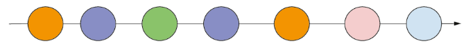

= Purpose

Collect all resources in prep for the main application on master branch

== When to use Kafka Streams (as of Kafka 0.10)

*Definition of Stream:* Working  with  data  as  it’s  arriving  in  your  system. 
*Definition of Stream processing:* The ability to work with an infinite stream of data with continuous computation, as it flows, with no need to collect or store the data to act on it.

This marble diagram is a simple representation of stream processing. Each circle represents some information or an event occurring at a particular point in time. The number of events is unbounded and moves continually from left to right.
 

Recommended use cases
------------------------
* Application Development			
* “Fast Data” apps (small or big data) 
* Reactive and stateful applications
* Linear streams
* Event-driven systems
* Continuous transformations
* Continuous queries
* Microservices

Questionable use cases
--------------------------
* Data Science / Data Engineering
* “Heavy lifting”
* Data mining
* Non-linear, branching streams (graphs)
* Machine learning, number crunching
* What you’d do in a data warehouse

=== Use Cases

1. Credit card fraud
—A credit card owner may not notice a card has been stolen, but by reviewing purchases as they happen against established patterns (location, general spending habits), you may be able to detect a stolen credit card and alert the owner.

2. Intrusion detection
—Analyzing application log files after a breach has occurred may be helpful to prevent future attacks or to improve security, but the ability to monitor aberrant behavior in real time is critical.

3. A large race, such as the New York City Marathon 
—Almost all runners will have a chip on their shoe, and when runners pass sensors along the course, you can use that information to track the runners’ positions. By using the sensor data, you can determine
the leaders, spot potential cheating, and detect whether a runner is potentially having problems.

4. The financial industry
—The ability to track market prices and direction in real time is essential for brokers and consumers to make effective decisions about when to sell or buy.

=== Not a solution for 
When you  need  to  use  a  large amount  of  data  over  time  to  eliminate  anomalies  and  identify  patterns  and  trends.  Here the focus is on analyzing data over time, rather than just the most current data:
1. Economic forecasting
—Information is collected on many variables over an extended period of time in an attempt to make an accurate forecast, such as trends in interest rates for the housing market.

2. School curriculum changes
—Only after one or two testing cycles can school administrators measure whether curriculum changes are achieving their goals.

Use Streams: If you need to report on or take action immediately as  data  arrives,  stream  processing  is  a  good  approach.  
Don't: If  you  need  to  perform  in-depth analysis or are compiling a large repository of data for later analysis, a stream-processing approach  may  not  be  a  good  fit.  Let’s  now  walk  through  a  concrete  example  of  stream processing

== KAFKA Streams Code Example
KStream <Integer, Integer> input =  builder.stream(“numbers-topic”);

* *Stateless computation*

[source, java]
----
KStream<Integer, Integer> doubled = input.mapValues(v -> v * 2);
----

* *Stateful computation*

[source, java]
----
KTable<Integer, Integer> sumOfOdds= input.filter((k,v) -> v % 2 != 0).selectKey((k, v) -> 1).reduceByKey((v1, v2) -> v1 + v2, ”sum-of-odds");
----

== Resources
* iot-amq-streams demo:

= Pre-Requisites
* OCP
* KAFKA Cluster Configuration
* AMQ Streams
*
